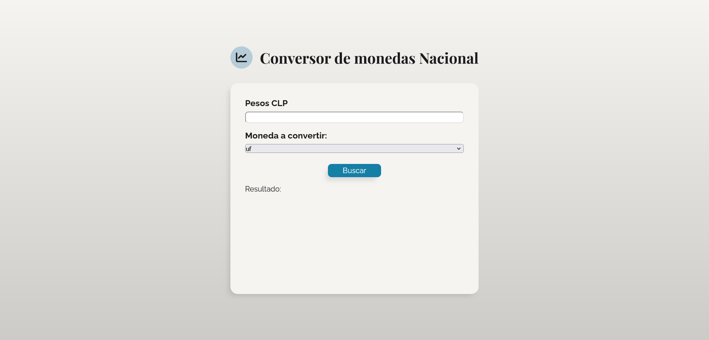
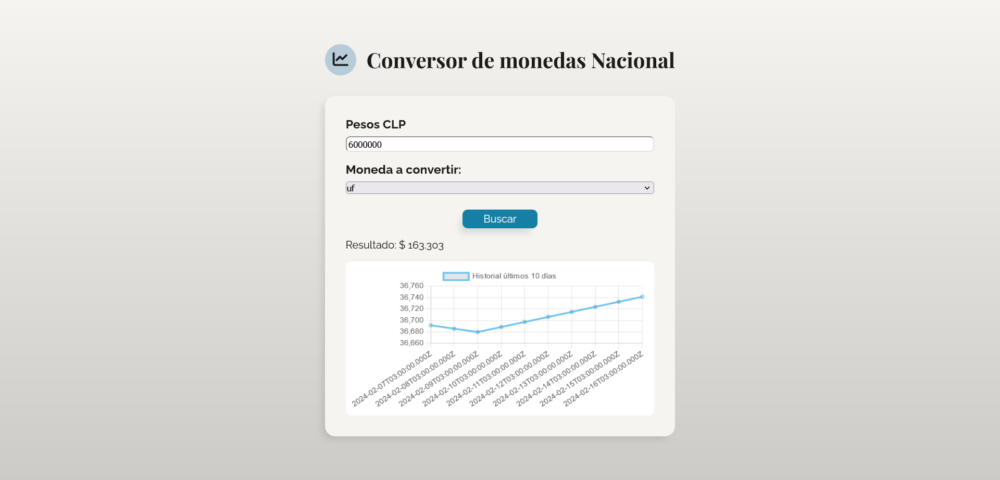
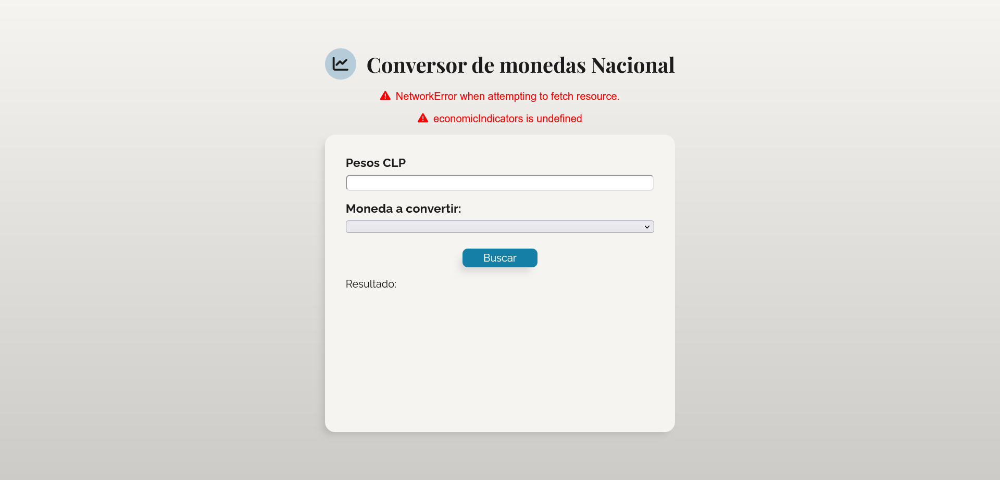

# Prueba - Conversor de Monedas 💱

En esta prueba, aplicaré los conceptos y herramientas aprendidas hasta ahora para desarrollar un conversor de monedas a partir de un monto en pesos chilenos, utilizando la API de mindicador.cl y el método fetch.

## Descripción del Desafío 📝

El objetivo es crear una página web que permita ingresar una cantidad de pesos chilenos, seleccionar la moneda a la que se desea convertir, y luego mostrar el valor convertido. Además, se debe utilizar una librería de JavaScript de gráficas para mostrar un historial de los últimos 10 días del valor de la moneda seleccionada.

## Capturas de Pantalla 🖼️

### Maqueta General


### Búsqueda Exitosa


### Búsqueda Fallida


## Requerimientos del Desafío 🎯

1. **Obtención de Tipos de Cambio desde mindicador.cl:** Se debe obtener los tipos de cambio desde la API de mindicador.cl utilizando el método fetch.
   
2. **Cálculo Correcto del Cambio y Visualización en el DOM:** Debe calcularse correctamente el cambio y mostrarse en el DOM al realizar la conversión.

3. **Selección de Más de un Tipo de Moneda:** El select debe implementar más de un tipo de moneda (con al menos 2 opciones) y todos los cambios deben funcionar correctamente.

4. **Manejo de Errores con Try Catch:** Debe implementarse try catch para ejecutar el método fetch y capturar posibles errores, mostrando el mensaje de error en el DOM en caso de problemas.

5. **Implementación del Gráfico Solicitado:** Se debe implementar el gráfico solicitado mostrando el historial de los últimos 10 días del valor de la moneda seleccionada.

## Solución a Requerimientos 😉

1. **Obtención de Tipos de Cambio desde mindicador.cl:**
```javascript
const nationalCurrencysToAnArray = async () => {
    try {
        let res = await fetch("https://mindicador.cl/api");
        const dataIndicators = await res.json();
        const currencysToAnArray = Object.keys(dataIndicators);
        const currencysArray = currencysToAnArray.slice(3);
        return currencysArray;
    } catch (e) {
        errorMessage(e.message);
    }
};
```
2. **Cálculo Correcto del Cambio y Visualización en el DOM:**
```javascript
const calculateCurrencyConversion = async (amount, currency) => {
    try {
        let res = await fetch(`https://mindicador.cl/api/${currency}`);
        const dataIndicators = await res.json();
        const resultValue = parseFloat((amount / dataIndicators.serie[0].valor).toFixed(3));
        calculatedConversion.innerText = `$ ${resultValue}`;
    } catch (e) {
        errorMessage(e.message);
    }
};
```
3. **Selección de Más de un Tipo de Moneda:**
```javascript
const setCurrencysToEconomicIndicators = async () => {
    try {
        economicIndicators = await nationalCurrencysToAnArray();
        economicIndicatorsToSelect();
    } catch (e) {
        errorMessage(e.message);
    }
};
```
4. **Manejo de Errores con Try Catch:**
```javascript
let errorMessageContainer = "";
const errorMessage = (message) => {
    errorMessageContainer += `<li><i class="fa-solid fa-triangle-exclamation"></i>${message}</li>`;
    errorMessageText.innerHTML = errorMessageContainer;
};
```
5. **Implementación del Gráfico Solicitado:**
```javascript
const renderGraph = async (currency) => {
    try {
        const data = await forexChart(currency);
        const config = {
            type: "line",
            data: {
                labels: data.xAxislabels,
                datasets: data.datasets,
            },
        };
        const myChart = document.querySelector("#myChart");
        if (myChart.chart) {
            myChart.chart.destroy();
        }
        myChart.style.backgroundColor = "white";
        myChart.chart = new Chart(myChart, config);
    } catch (e) {
        errorMessage(e.message);
    }
};
```
## Estructura del Código 🧱

El código HTML proporciona la estructura básica de la página, incluyendo un input para ingresar la cantidad de pesos chilenos, un select para elegir la moneda a convertir, un botón para iniciar la consulta y una sección para mostrar el resultado y el gráfico.

El código CSS proporciona estilos visuales para mejorar la apariencia de la página y hacerla más atractiva para el usuario.

El código JavaScript maneja la lógica de obtención de tipos de cambio, cálculo de la conversión, manejo de errores, y creación del gráfico.

## Mejoras Futuras 🚀

En el futuro, podría considerar añadir funcionalidades adicionales como la posibilidad de invertir la conversión (convertir de la moneda seleccionada a pesos chilenos), implementar más tipos de monedas, o agregar filtros para el historial de conversiones.
